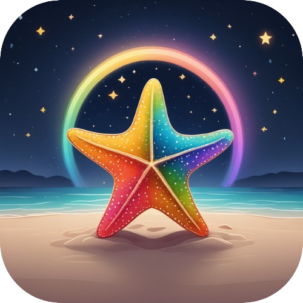

<br/>
<div align="center"><h1></h1></div>
<br/>
<p align="center">
  <a href="https://github.com/Chandima-Prabhath/StarFish">
  
  </a>
  <a href="https://github.com/Chandima-Prabhath/StarFish/actions/workflows/android-release.yml">

  </a>
  <a href="https://github.com/Chandima-Prabhath/StarFish">
  
  </a>
</p>

# StarFish

This is a starter template for building mobile applications with React, Vite, and [Capacitor](https://capacitorjs.com). It includes a basic project setup and some sample components to help you get started.

## Getting Started

To use this starter template, you'll need to have Node.js on machine.

Clone this repository:

```
git clone https://github.com/Mohit-wednesday/react-vite-capacitor.git

```

Install the dependencies:

```
yarn install
```

Run the development server:

```
yarn dev
```

To build the app for production:

```
yarn build
```

To run the app on a device, use the Capacitor CLI:

```
yarn run:ios // 🍎 For iOS
yarn run:android // 🤖 For Android

```

To open the respective directory in Xcode or Android Studio:s

```
yarn open:ios // 🍎 For iOS
yarn open:android // 🤖 For Android
```

## 📁 Project Structure

```
├── public
├── android
├── ios
├── src
│ ├── components
| ├── assets
│ ├── App.css
| ├── App.tsx
│ ├── main.tsx
| ├── index.css
| ├── vite-env.d.ts
├── .gitignore
├── index.html
├── package.json
├── README.md
├── vite.config.js
├── tsconfig.json
├── tsconfig.node.json
└── capacitor.config.json
```

### 👥 Contributing

If you'd like to contribute to this starter template, feel free to submit a pull request.
